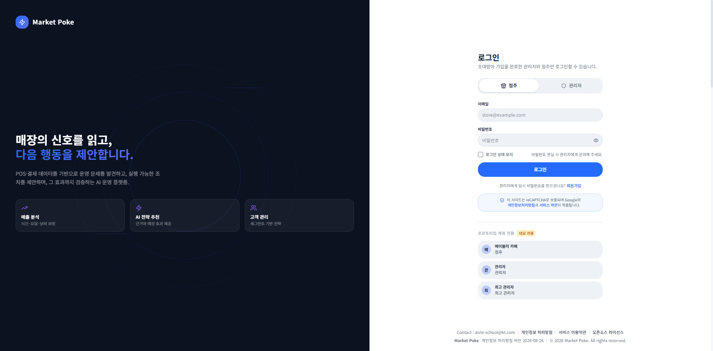
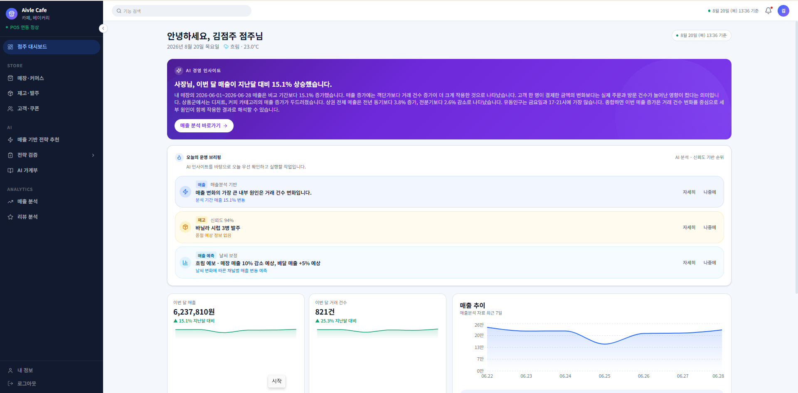
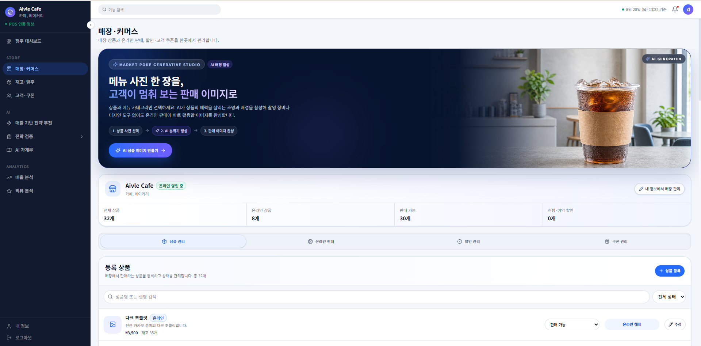
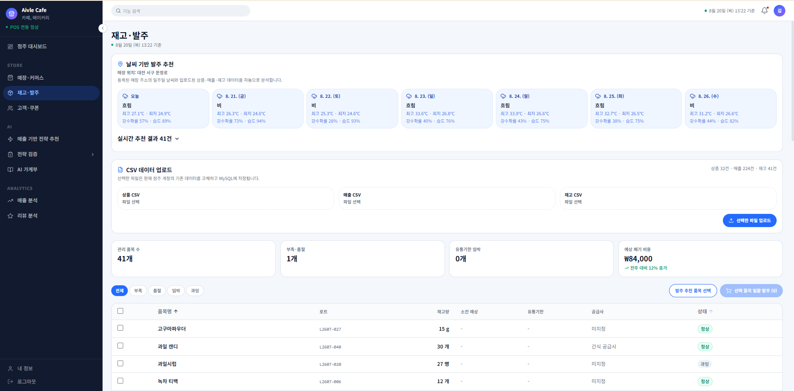
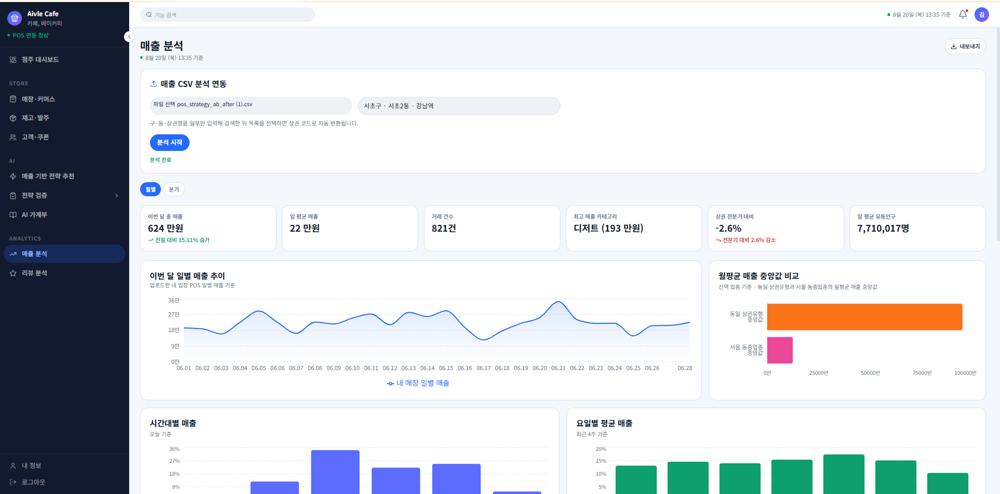
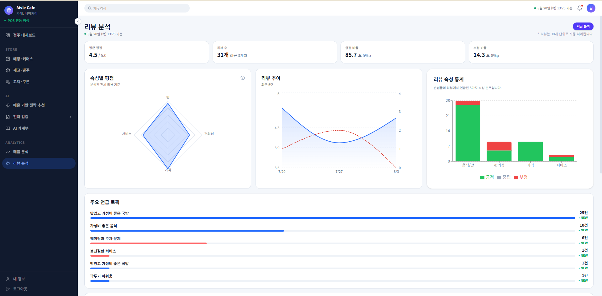

# Market Poke Frontend

Market Poke의 점주·관리자용 웹 프론트엔드입니다.

점주는 매출·재고·리뷰 현황과 AI 기반 운영 전략을 확인할 수 있으며, 관리자는 입점 매장과 서비스 운영 현황을 관리할 수 있습니다.

## 실행 경로

```
로컬주소 : http://localhost:8080
배포주소 : https://dt555m45x3ua9.cloudfront.net/login
```

## 주요 기능

### 점주

- 매장 운영 대시보드
- 매출 및 비용 분석
- 장부 및 재고 관리
- AI 운영 전략 추천
- 전략 적용 효과 검증
- 리뷰 통계 및 AI 분석
- 고객 및 리포트 조회
- 커머스 및 상품 이미지 관리
- 계정 정보 관리

### 관리자

- 전체 매장 포트폴리오 조회
- 매장별 상세 현황 확인
- 위험 매장 모니터링
- 전략 적용 효과 및 ROI 분석
- 매출 목표 관리
- 공지사항 관리
- 서비스 상태 확인
- 점주·관리자 계정 및 초대 관리
- IAM 감사 로그 조회

일부 관리자 기능은 `SUPER_ADMIN` 권한에서만 사용할 수 있습니다.

## 기술 스택

| 구분 | 기술 |
| --- | --- |
| UI | React 18 |
| 언어 | TypeScript |
| 빌드 도구 | Vite 6 |
| 라우팅 | React Router DOM 6 |
| 스타일링 | Tailwind CSS 4 |
| HTTP 통신 | Fetch API, Axios |
| 차트 | Recharts |
| 아이콘 | Lucide React |
| 정적 분석 | ESLint |
| 패키지 관리 | npm |

## 디렉토리 구조

```text
BP20-FE/
├─ src/
│  ├─ app/          # 앱 진입 설정, 라우터, 전역 Provider, 역할별 layout
│  ├─ pages/        # URL에 직접 연결되는 화면
│  ├─ features/     # 사용자 행동과 업무 단위의 기능 및 API 로직
│  ├─ entities/     # 사용자, 매장, 매출, 재고 등 도메인 타입과 데이터 로직
│  ├─ shared/       # 여러 기능에서 공통으로 사용하는 UI, API, 유틸리티, 스타일
│  ├─ mocks/        # 개발 및 데모용 mock 데이터
│  └─ main.tsx      # React 애플리케이션 진입점
├─ .env.example     # 환경변수 작성 예시
├─ package.json     # 의존성 및 npm 명령어
├─ tsconfig.json    # TypeScript 설정
└─ vite.config.ts   # Vite 빌드, 별칭 및 개발 프록시 설정
```

새 기능은 역할이 아니라 업무 도메인을 기준으로 `features`와 `entities`에 배치하고,
URL에 직접 연결되는 화면만 `pages`에 둡니다.

## 실행 환경

- Node.js 20 이상
- npm 10 이상

## 로컬 실행

```bash
cd BP20-FE
```

```bash
npm install
```

'.env` 파일 생성

```bash
cp .env.example .env
```

Windows PowerShell일 경우

```powershell
Copy-Item .env.example .env
```

개발 서버 실행

```bash
npm run dev
```

## 검증

```bash
npm run typecheck
npm run build
```

프로덕션 빌드를 로컬에서 확인하려면 다음 명령을 실행합니다.

```bash
npm run preview
```

## 실행화면

로그인 화면



메인 대시보드 화면



매장·커머스 화면



재고·발주 화면



매장분석 화면



리뷰 화면

